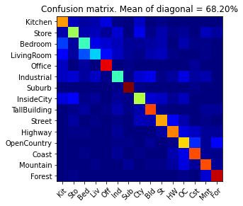
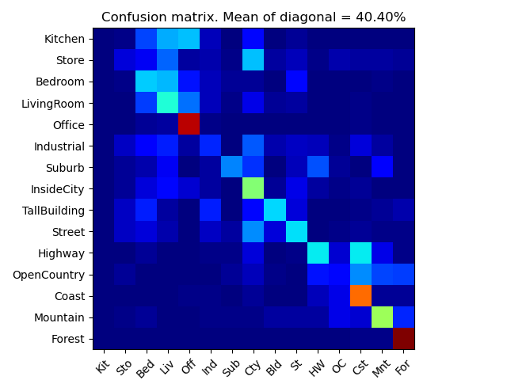
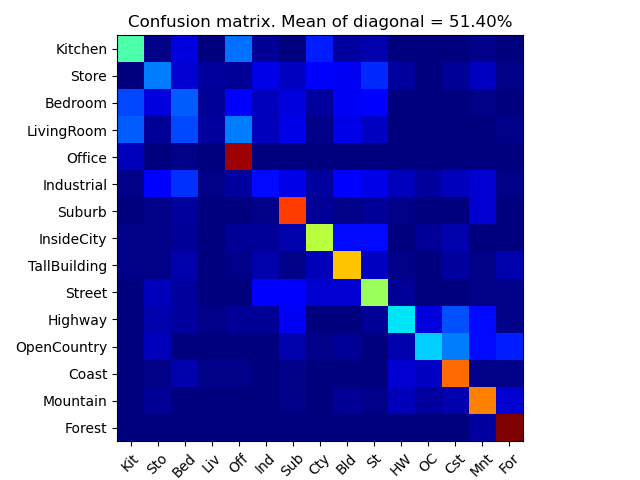
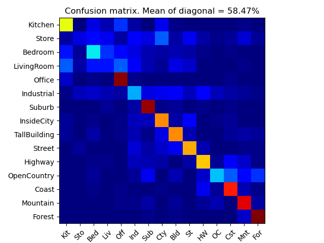
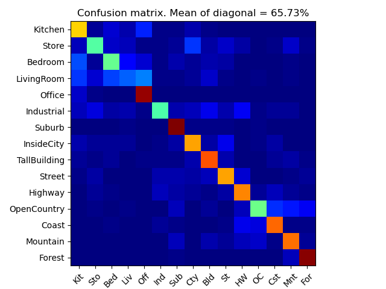
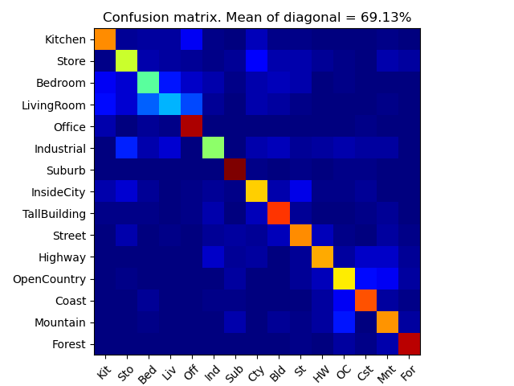
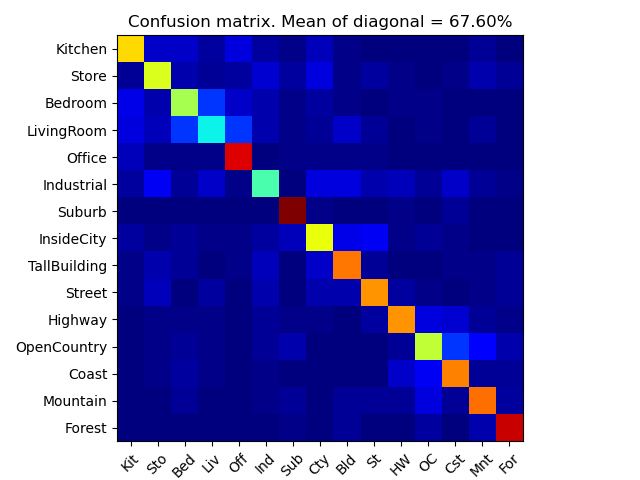
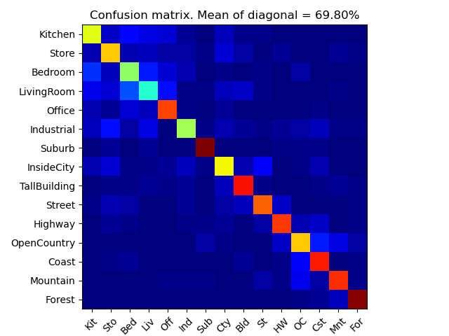
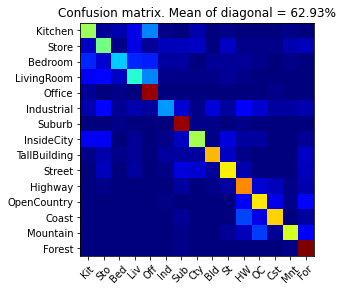
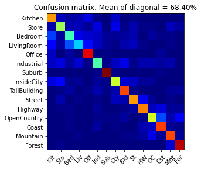

# Computer Vision Assignment Report

Title: ***Scene recognition with bag of words***

Student Name: ***Mandan Chao***

Student ID: ***11811737***

### 1. Experimental Design

- Use cross-validation to measure performance rather than the fixed test / trainsplit provided by the starter code. Randomly pick 100 training and 100 testingimages for each iteration and report average performance and standard-deviations.

    ```python
    def cross_validation_svm(svm, train_image_feats, label_ovr, cv=5):
        temp = sklearn.model_selection.cross_val_score(svm, train_image_feats, label_ovr, cv=cv)
        mean = temp.mean()
        print("Accuracy: %0.2f (+/- %0.2f)" % (temp.mean(), temp.std() * 2))
    ```

- Add a validation set to your training process to tune learning parameters. This validation set could either be a subset of the training set or some of theotherwise unused test set.

    ```python
    def auto_tune_svm(svm, train_image_feats, label_ovr, cv):
        C = svm.get_params()['C']
        while mean <= 0.90 and C > 1:
            C -= 0.1
            svm.set_params(C=C, loss='squared_hinge')
            svm.fit(train_image_feats, label_ovr)
            temp = sklearn.model_selection.cross_val_score(svm, train_image_feats, label_ovr, cv=cv)
            mean = temp.mean()
            print("Accuracy: %0.2f (+/- %0.2f)" % (temp.mean(), temp.std() * 2))
    ```

- Experiment with many different vocabulary sizes and report performance. E.g.10, 20, 50, 100, 200, 400, 1000.

    ```python
    vocab_set = [10, 20, 50, 100, 200, 400, 1000]
    for size in vocab_set:
        fname = 'vocab_'+str(size)
        vocab_size = size
        vocab = sc.build_vocabulary(train_image_paths, vocab_size)
        with open(vocab_filename, 'wb') as f:
            pickle.dump(vocab, f)
            print('{:s} saved'.format(fname+'.pkl'))
        train_image_feats = sc.get_bags_of_sifts(train_image_paths, vocab_filename)
        test_image_feats = sc.get_bags_of_sifts(test_image_paths, vocab_filename)
        predicted_categories = sc.svm_classify(train_image_feats, train_labels, test_image_feats)
        plot_results(test_labels, categories, abbr_categories, predicted_categories, fname+'.png')
    ```

### 2. Experimental Results Analysis

- **Cross Validation**

    My cross validation (CV) is done by `sklearn.model_selection.cross_val_score` function with a five-fold setting. The CV result of Section 3b is `Accuracy: 0.88 (+/- 0.26)`.

- **Learning Parameters Tuning**

    According to the CV result, I desinged a function `auto_tune_svm` for autonomously tuning hyper-parameters of SVMs. Among tunable parameters of `sklearn.svm.LinearSVC`, I found the regularization parameter `C` mostly affect the performance of it. By definition, the strength of the regularization is inversely proportional to C. I decreased `C` iteratively to get a better CV results, and the final test accuracy is shown below.

    ```
    Using SVM classifier to predict test set categories
    Accuracy: 0.88 (+/- 0.26)
    Accuracy: 0.87 (+/- 0.32)
    Accuracy: 0.87 (+/- 0.32)
    Accuracy: 0.88 (+/- 0.31)
    ...
    Accuracy: 0.89 (+/- 0.25)
    Accuracy: 0.92 (+/- 0.03)
    Accuracy: 0.92 (+/- 0.05)
    Accuracy: 0.97 (+/- 0.02)
    ...
    Accuracy: 0.94 (+/- 0.08)
    Accuracy: 0.93 (+/- 0.01)
    Accuracy: 0.96 (+/- 0.04)
    Accuracy: 0.96 (+/- 0.04)
    ```
     

- **Vocabulary Size Analysis**

    The performance of SVMs with different vocabulary size are plotted as below.

    1. size = 10
     
     
    1. size = 20
     

    1. size = 50 
     

    1. size = 100
     

    1. size = 200
     

    1. size = 400
     

    1. size = 1000
     

From these confusion matrices we can conclude that the larger the vocabulary size, the higher the classification accuracy. However, there is an upper bound for accuracy about 70% while increasing the vocabulary size. This is because features are non-linear while linear SVMs can only classify linear features, so there is an upper limit for the classification accuracy of linear SVMs.

### 3. Bonus Report (If you have done any bonus problem, state them here)

- Accelerate the process of generating sift features

    ```python
    frames, descriptors = vlfeat.sift.dsift(img, step, fast)
    ```
    1. To save computation time, I called `vl_dsift` with a large `step` size (16) here, but a smaller `step` size (4) in get_bags_of_sifts.

    1. The `fast` option can be used to turn on an variant of the descriptor which it is much faster.

- Add cross validation and the accuracy of three combinations exceeds the average

    1. The cross validation code can be found in [Experimental Results Analysis](#experimental-results-analysis)
    1. The accuracy of tiny-image features plus nearest neighbor classifier:
     

    1. The accuracy of SIFT features plus nearest neighbor classifier:
     

    1. The accuracy of SIFT features plus linear SVM classifier:
     